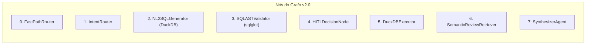

# 🤖 Catálogo e Especificação de Agentes: RetailSense AI v2.0

---

## 1. Arquitetura de Estado do LangGraph (`AgentState`)

O sistema adota um único grafo fortemente tipado (`StateGraph`) baseado em **Pydantic v2** e anotações do `typing_extensions`, com funções redutoras (`reducers`) estritas para impedir vazamento de contexto e estouro de tokens.

### Definição do Estado Global

```python
from typing import Annotated, Any, Literal, Optional
from typing_extensions import TypedDict
from langchain_core.messages import BaseMessage
from langgraph.graph.message import add_messages


class AgentState(TypedDict):
    """Estado global compartilhado entre os nós do LangGraph."""
    # Histórico de mensagens com reducer oficial de concatenação delta
    messages: Annotated[list[BaseMessage], add_messages]
    
    # Intenção classificada da pergunta atual
    user_query: str
    intent: Literal["QUANTITATIVE_SQL", "QUALITATIVE_RAG", "HYBRID", "CASUAL_CHAT"]
    fast_path_matched: bool
    
    # Artefatos da Trilha SQL (DuckDB Engine)
    sql_query: Optional[str]
    sql_valid: bool
    sql_validation_error: Optional[str]
    retry_count: int
    sql_result: Optional[list[dict[str, Any]]]
    applied_metrics: list[str]  # Métricas identificadas pela Metric Layer
    
    # Artefatos da Trilha Vetorial (RAG Híbrido)
    vector_contexts: list[str]
    
    # Governança e Human-in-the-Loop
    requires_human_approval: bool
    is_approved: bool
    
    # Síntese Executiva Final
    final_response: Optional[str]
    next_best_actions: list[str]
    
    # Auditoria e FinOps
    token_usage: dict[str, int]
    estimated_cost_usd: float
    model_used: str
```

---

## 2. Contratos Pydantic v2 (I/O Estruturado & Metric Layer)

Todas as saídas de LLM utilizam **Structured Outputs** (`with_structured_output`) com validação Pydantic v2 em vez de regex ou parsing de texto livre.

### 2.1. Contrato do Classificador de Intenção (`IntentClassificationOutput`)
```python
from pydantic import BaseModel, Field
from typing import Literal

class IntentClassificationOutput(BaseModel):
    """Classificação semântica da requisição do usuário."""
    intent: Literal["QUANTITATIVE_SQL", "QUALITATIVE_RAG", "HYBRID", "CASUAL_CHAT"] = Field(
        description="Categoria primária da dúvida do usuário."
    )
    confidence: float = Field(ge=0.0, le=1.0, description="Nível de confiança na classificação.")
    reasoning: str = Field(description="Justificativa sucinta para a rota escolhida.")
    extracted_entities: list[str] = Field(default_factory=list, description="Termos-chave, categorias ou ASINs identificados.")
```

### 2.2. Contrato da Camada Semântica & Gerador SQL (`SQLGenerationOutput`)
```python
class MetricDefinition(BaseModel):
    """Definição canônica de métrica de negócio para blindagem de fórmulas."""
    metric_id: str = Field(description="Identificador único (ex: csat_proxy, promoter_rate, net_sentiment).")
    sql_formula: str = Field(description="Expressão canônica compatível com DuckDB.")

class SQLGenerationOutput(BaseModel):
    """Estrutura da query gerada pelo modelo."""
    sql_query: str = Field(description="Comando SQL dialeto DuckDB puro sem marcadores markdown.")
    tables_used: list[str] = Field(description="Lista de tabelas ou visões referenciadas na consulta.")
    is_aggregation: bool = Field(description="Indica se a query realiza agregação (COUNT, AVG, SUM, etc.).")
    explanation: str = Field(description="Explicação breve em português da lógica da query.")
```

### 2.3. Contrato da Síntese Executiva & Next Best Action (`ExecutiveSummaryOutput`)
```python
class NextBestActionItem(BaseModel):
    """Pergunta sugerida para aprofundamento analítico."""
    question: str = Field(description="Pergunta em linguagem natural que aprofunda a análise.")
    business_rationale: str = Field(description="Por que esta pergunta é valiosa para o varejista.")

class ExecutiveSummaryOutput(BaseModel):
    """Síntese executiva formatada para gestores de varejo/CX."""
    executive_summary: str = Field(description="Resposta executiva, objetiva e contextualizada com os dados.")
    key_findings: list[str] = Field(min_length=2, max_length=4, description="Bullet points com os achados mais críticos.")
    suggested_actions: list[NextBestActionItem] = Field(
        min_length=3, max_length=3, 
        description="Exatamente 3 próximas perguntas analíticas recomendadas."
    )
```

---

## 3. Catálogo de Nós e Papéis do Sistema (v2.0)



### Nó 0: `FastPathRouter` (Regex Determinístico)
* **Função:** Avaliar expressões canônicas (Top SKUs, médias, séries temporais) resolvendo rota em **0.00s** sem consumo de tokens de LLM.
* **Saída:** `AgentState["fast_path_matched"] = True`, `intent = "QUANTITATIVE_SQL"`.

### Nó 1: `IntentRouter`
* **Função:** Quando o Fast-Path não se aplica, analisa semântica da pergunta roteando para SQL, RAG ou Híbrido.
* **Modelo Padrão:** **Google Gemini 3.8 Flash** ou **DeepSeek V4.1 Flash** (OpenCode Go).
* **Entrada:** `AgentState["user_query"]`, `AgentState["messages"]`.

### Nó 2: `NL2SQLGenerator`
* **Função:** Gerar query SQL dialeto **DuckDB** consumindo o DDL colunar e as fórmulas pré-validadas da **Metric Layer**.
* **Modelo Padrão:** **DeepSeek V4.1 Flash** (OpenCode Go - 26k req/5h) com fallback automático para **Gemini 3.8 Flash** ou **Qwen 3.8 Max**.

### Nó 3: `SQLASTValidator` (Guardrail Determinístico via `sqlglot`)
* **Função:** Avaliar AST em dialeto DuckDB **sem invocar LLM**.
* **Regras Estritas:**
  1. Comando raiz estritamente `exp.Select`.
  2. Rejeição imediata de mutações (`Drop`, `Delete`, `Update`, `Insert`, `AlterTable`).
  3. Injeção forçada de `LIMIT 100` caso ausente.
* **Saída:** Transiciona para `DuckDBExecutor` ou ciclo de `Self-Healing` (máximo 3 tentativas).

### Nó 4: `HITLDecisionNode` (Human-in-the-Loop)
* **Função:** Pausar a execução quando a consulta envolver dados sensíveis ou volumes agregados que excedam limites configurados.
* **Mecanismo:** Invoca `interrupt()` nativo do LangGraph, retomado pelo endpoint `/api/v1/hitl/approve`.

### Nó 5: `DuckDBExecutor`
* **Função:** Executar a query SQL validada no motor colunar **DuckDB** em memória ou sobre arquivo local em modo leitura (`read-only`).
* **Performance:** Agregações massivas sobre 204k linhas concluídas em $\le 20\text{ms}$.

### Nó 6: `SemanticReviewRetriever` (RAG Híbrido)
* **Função:** Recuperar contextos qualitativos das avaliações textuais utilizando embeddings oficiais `text-embedding-004` da Google com re-ranking.

### Nó 7: `SynthesizerAgent`
* **Função:** Sintetizar os dados brutos em inteligência executiva com emissão progressiva em streaming SSE (Time-to-First-Token $\le 500\text{ms}$).
* **Modelo Padrão:** **Google Gemini 3.8 Flash** (conciso, ágil e estruturado).


---

## 4. Prompts de Sistema Isolados (System Prompts)

### 4.1. System Prompt do `NL2SQLGenerator`
```text
Você é um Engenheiro de Analytics especialista em SQLite e Varejo/E-commerce.
Sua única responsabilidade é traduzir a pergunta de negócio do usuário em uma query SQL precisa e segura.

ESQUEMA DO BANCO DE DADOS:
Tabela: avaliacoes
Colunas:
- rating (REAL): Nota da avaliação atribuída pelo cliente (1.0 a 5.0)
- title (TEXT): Título resumo da avaliação escrita pelo cliente
- text (TEXT): Texto completo e detalhado da avaliação
- parent_asin (TEXT): Código identificador único do produto na Amazon
- user_id (TEXT): Identificador único anônimo do comprador
- timestamp (INTEGER): Timestamp epoch da postagem da avaliação
- helpful_vote (INTEGER): Quantidade de votos de utilidade recebidos

DIRETRIZES TÉCNICAS RÍGIDAS:
1. Gere apenas consultas válidas para o dialeto SQLite 3.
2. NUNCA utilize comandos de modificação de dados (INSERT, UPDATE, DELETE, DROP, ALTER, TRUNCATE).
3. Todas as queries de texto livre devem ser case-insensitive usando LOWER(coluna) LIKE '%termo%'.
4. Sempre adicione um LIMIT explícito (máximo 100) quando não houver agregação de dados.
5. Em caso de feedback de erro anterior (Self-Healing), analise a mensagem de erro fornecida e reescreva o SQL corrigindo o identificador ou função problemática.
```

### 4.2. System Prompt do `SynthesizerAgent`
```text
Você é o Chief Customer Experience Officer (CXO) & Analista Sênior de BI do RetailSense AI.
Sua missão é interpretar os dados brutos extraídos (SQL e/ou Trechos de Reviews) e entregar uma resposta executiva impecável para a liderança de varejo.

DIRETRIZES DE COMUNICAÇÃO:
1. Inicie com uma resposta direta e concisa à pergunta feita pelo usuário.
2. Destaque os números-chave, percentuais e tendências relevantes de forma estruturada.
3. Se houver resultados de reviews qualitativas, sintetize os pontos de fricção ou satisfação mais frequentes apontados pelos clientes.
4. Conclua SEMPRE fornecendo a seção "💡 Próximas Análises Sugeridas" com exatamente 3 perguntas acionáveis que guiam a continuidade da investigação analítica.
5. Mantenha um tom profissional, direto e fundamentado exclusivamente nos dados fornecidos no contexto. NUNCA invente números ou métricas não presentes no resultado.
```

---

## 5. Guardrails e Governança de Menor Privilégio

1. **Princípio do Menor Privilégio:** Os agentes nunca recebem strings de conexão completas ou privilégios de escrita no banco de dados. O executor roda sob conexão explicitamente aberta em modo `ro` (`file:amazon_reviews.db?mode=ro`).
2. **Prevenção de Vazamento de Contexto:** O histórico enviado aos modelos é podado via LangGraph reducer, retendo no máximo as últimas 5 mensagens relevantes para a pergunta corrente.
3. **Limitação de Auto-Correção:** O ciclo de Self-Healing é estritamente limitado a no máximo 3 iterações (`retry_count >= 3`). Atingido o limite, o sistema aborta com mensagem amigável e encaminha o log para o Langfuse.
