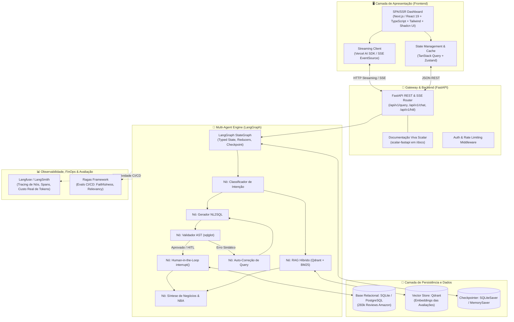
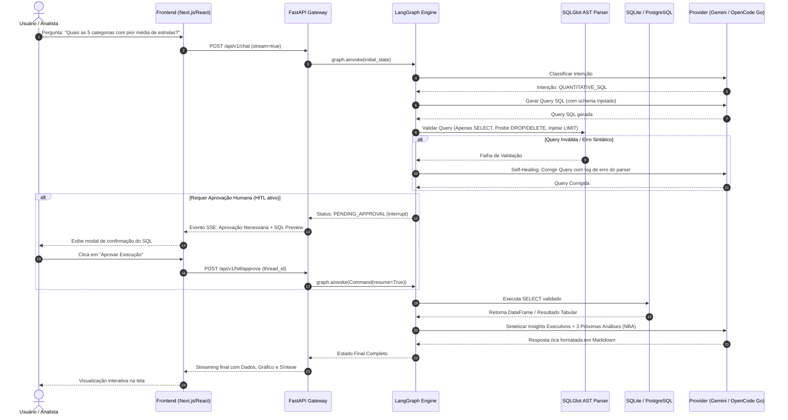

# 📐 Especificação Técnica de Engenharia: RetailSense AI

---

## 1. Topologia de Software & Arquitetura Geral

O **RetailSense AI** segue o padrão de arquitetura moderna desacoplada para startups globais, separando expressamente a camada de apresentação da camada de processamento analítico e inteligência.

### Diagrama de Arquitetura de Alto Nível (C4 Container Level)



---

## 2. Diagrama de Sequência: Ciclo de Consulta com HITL e Self-Healing



---

## 3. Decisões de Arquitetura de Software (ADRs)

### ADR 001: Desacoplamento Frontend/Backend e Eliminação de Streamlit
* **Status:** Aprovado.
* **Contexto:** O projeto legado utilizava Streamlit como um monólito onde toda a lógica de estado, chamadas de LLM, queries SQL e renderização gráfica coexistiam no arquivo `app.py`.
* **Decisão:** O Streamlit é expressamente banido por ser uma ferramenta prototípica, inadequada para concorrência, que força reruns inteiros de scripts e carece de componentização real. Adota-se uma **arquitetura desacoplada**:
  - **Backend:** FastAPI assíncrono com validação estrita via Pydantic v2.
  - **Frontend:** SPA/SSR em Next.js (App Router) ou React 19 com Vite / TanStack Start, TypeScript estrito, Tailwind CSS e Shadcn UI.
* **Consequências:** Separação limpa de responsabilidades, facilidade para testes automatizados, escalabilidade independente e possibilidade de disponibilizar múltiplos clientes (Web, CLI, integrações via API).

---

### ADR 002: Orquestração Declarativa via LangGraph com Checkpointing
* **Status:** Aprovado.
* **Contexto:** O código anterior possuía laços procedurais manuais (`for tentativa in range(3)`) e flags no `st.session_state` para tentar realizar auto-correção e HITL. Se o usuário recarregasse a página, o estado era destruído.
* **Decisão:** Implementar a orquestração multi-agente utilizando o **LangGraph** nativo:
  - Definir um `StateGraph` formal com um contrato tipado (`AgentState`).
  - Utilizar `interrupt()` para Human-in-the-Loop nativo.
  - Utilizar `MemorySaver` (ou `SqliteSaver`) para persistir o histórico e os pontos de interrupção por `thread_id`.
* **Consequências:** Resiliência a falhas, transições de estado determinísticas, suporte a pausar/resumir execuções e rastreabilidade visual do fluxo.

---

### ADR 003: Validação Determinística de SQL com AST Parser (`sqlglot`)
* **Status:** Aprovado.
* **Contexto:** A segurança anterior dependia exclusivamente de instruções no System Prompt pedindo "nunca gere DELETE/DROP". Essa abordagem é frágil contra alucinações, manipulação de contexto e jailbreaks.
* **Decisão:** Integrar o **`sqlglot`** para parsing de AST (Abstract Syntax Tree) pré-execução:
  - Rejeitar qualquer nó da AST que não seja uma expressão pura de `SELECT`.
  - Bloquear acessos a tabelas de sistema ou esquemas não autorizados.
  - Garantir a injeção ou verificação de `LIMIT` para proteger contra sobrecarga de memória.
* **Consequências:** Proteção matemática/determinística contra ataques e erros acidentais, blindando o banco de dados mesmo que o LLM sofra injection.

---

### ADR 004: Documentação Interativa de APIs com Scalar (`scalar-fastapi`)
* **Status:** Aprovado.
* **Contexto:** O padrão legado utilizava Swagger UI tradicional, que possui design desatualizado, baixa ergonomia para testes interativos de payloads complexos e suporte limitado a SDKs gerados.
* **Decisão:** Servir a documentação viva em `/docs` e `/scalar` utilizando **Scalar** (`scalar-fastapi`). O Swagger UI padrão do FastAPI é explicitamente desativado (`docs_url=None`, `redoc_url=None`).
* **Consequências:** Interface de documentação padrão Stripe/Vercel, cliente de requisições interativo embutido, suporte nativo a temas Dark/Light e gerador instantâneo de snippets de código em cURL, Python, TypeScript e Go.

---

### ADR 007: Adoção de DuckDB como Motor Analítico Colunar de Custo Zero ($0.00/mês)
* **Status:** Aprovado.
* **Contexto:** O SQLite opera linha por linha (OLTP), sendo ineficiente para agregações estatísticas massivas sobre centenas de milhares de linhas concorrentes. Bancos gerenciados em nuvem (como Snowflake ou Azure SQL) implicariam custos contínuos ou risco de consumir créditos estudantis caso esquecidos ativos.
* **Decisão:** Adotar **DuckDB** como motor analítico colunar (OLAP) embutido no processo da aplicação Python:
  - Vetorização SIMD colunar processando agregações de 204.382 linhas em sub-20ms.
  - Leitura nativa e direta de arquivos **Apache Parquet** ou banco local `.duckdb`.
  - Custo de infraestrutura: **R$ 0,00 perpétuo**, sem servidores adicionais, instâncias de banco ou custos de rede.
* **Consequências:** Ganho de até 50x em velocidade analítica sobre o SQLite, eliminação de gargalos de I/O de disco e zero custo mensal de banco de dados.

---

### ADR 008: Tri-Tiering Agnóstico de LLMs (Gemini Pro + OpenCode Go + OpenRouter)
* **Status:** Aprovado.
* **Contexto:** Dependência de um único provedor cria risco de indisponibilidade (SPOF) e viés de auto-aprovação na camada de testes e auditoria com Ragas.
* **Decisão:** Arquitetura multi-provedor agnóstica orquestrada por perfil de tarefa:
  1. **Google Gemini Pro (Assinatura Ativa):**
     - `gemini-3.8-flash`: Síntese executiva e respostas de baixa latência.
     - `text-embedding-004`: Embeddings semânticos oficiais (768 dimensões) para o RAG Qualitativo sem custo adicional.
  2. **OpenCode Go (Assinatura Ativa):**
     - `deepseek-v4.1-flash`: Cota massiva de até 26.000 req/5h para geração SQL rápida.
     - `qwen3.8-max` / `deepseek-v4-pro`: Raciocínio de fronteira para queries analíticas densas com Window Functions.
  3. **OpenRouter (Modelos Gratuitos `:free` com Saldo $10+ Ativo):**
     - `nvidia/nemotron-3-ultra-550b-a55b:free` ou `google/gemma-4-31b-it:free`: Utilizados como **Juiz Imparcial Desacoplado no Ragas**, garantindo que o modelo que gerou a resposta não avalie a si mesmo.
* **Consequências:** Resiliência contra rate limits (99.99% uptime), auditoria sem viés e aproveitamento integral das assinaturas já contratadas pelo usuário.

---

### ADR 009: Camada Semântica Centralizada (Metric Layer)
* **Status:** Aprovado.
* **Contexto:** A geração de SQL livre diretamente sobre tabelas brutas pode gerar fórmulas divergentes para a mesma métrica (ex: um modelo calcula taxa de promotores dividindo por notas 4 e 5, outro apenas nota 5).
* **Decisão:** Codificar uma **Metric Layer** canônica com contratos Pydantic:
  - Fórmulas pré-definidas para CSAT Proxy, NPS Proxy, Taxa de 5 Estrelas e Séries Temporais.
  - Injeção das definições semânticas canônicas no prompt do NL2SQLGenerator, blindando os cálculos contra alucinações.
* **Consequências:** Consistência matemática total entre o dashboard analítico e as respostas do agente conversacional.

---

### ADR 010: Hospedagem Serverless no Azure for Students com Scale-to-Zero
* **Status:** Aprovado.
* **Contexto:** A aplicação precisa estar acessível online de forma contínua sem consumir os \$100 de crédito de estudante com custos de servidores ociosos.
* **Decisão:** Empacotar a aplicação em container Docker multi-stage (FastAPI + React 19 SPA) e realizar o deploy no **Azure Container Apps** ou **Azure App Service (Free F1 Tier)**:
  - O banco DuckDB / Parquet e os índices locais residem no volume da aplicação.
  - O container escala para zero quando inativo, consumindo zero recursos computacionais.
* **Consequências:** Preservação integral dos créditos do Azure Students, deploy limpo via CI/CD (GitHub Actions com minutos gratuitos do Student Pack) e disponibilidade global HTTPS com certificado SSL gratuito.

---

## 4. Stack Tecnológica Oficial (v2.0)

```
┌──────────────────────────────────────────────────────────────┐
│                  RETAILSENSE AI v2.0 STACK                   │
├──────────────────────────────────────────────────────────────┤
│ Camada              │ Tecnologias Escolhidas                 │
├─────────────────────┼────────────────────────────────────────┤
│ Backend API         │ Python 3.11+, FastAPI 0.111+, Uvicorn  │
│ Streaming           │ Server-Sent Events (SSE) / EventSource │
│ API Docs            │ Scalar (scalar-fastapi em /docs)       │
│ Modelagem & Schema  │ Pydantic v2, Metric Layer Canônica     │
│ Multi-Agentes       │ LangGraph, LangChain-core              │
│ Validação SQL AST   │ sqlglot (AST Parser, LIMIT Forçado)    │
│ Motor Analítico     │ DuckDB (OLAP Colunar SIMD) + Parquet   │
│ RAG Vetorial        │ LanceDB / Qdrant Embutido ($0 infra)   │
│ Provedores de LLM   │ Google Gemini Pro (Gemini 3.8 Flash,   │
│                     │ text-embedding-004), OpenCode Go       │
│                     │ (DeepSeek V4.1 Flash, Qwen 3.8 Max),   │
│                     │ OpenRouter Free (Nemotron 3 Ultra 550B)│
│ Frontend Corporativo│ React 19, TypeScript, Vite, Tailwind,  │
│ (100% Tema Claro)   │ Recharts, Lucide Icons, Zustand        │
│ Observabilidade     │ Prometheus (/metrics), Langfuse        │
│ Avaliação (Evals)   │ Ragas (LLM-as-a-Judge no CI/CD)        │
│ Qualidade de Código │ ruff, mypy, gitleaks, pre-commit       │
│ Nuvem & Deploy      │ Docker, Azure for Students ($0/mês)    │
└──────────────────────────────────────────────────────────────┘
```

---

## 5. Estrutura de Diretórios Recomendada

```
d:\varejo_ecommerce_ia/
├── .github/
│   └── workflows/
│       ├── ci.yml                 # Testes, ruff, mypy, gitleaks
│       └── evals.yml              # Pipeline Ragas de assertividade com OpenRouter
├── .pre-commit-config.yaml        # Hooks de qualidade pré-commit
├── PRD.md                         # Product Requirements Document v2.0
├── PROJECT_SPEC.md                # Esta especificação técnica viva
├── AGENTS.md                      # Contratos Pydantic e papéis dos agentes
├── TASKS.md                       # Backlog granular em fases
├── README.md                      # Documentação executiva e quickstart
├── pyproject.toml                 # Configurações do projeto e dependências
├── Dockerfile                     # Container multi-stage otimizado
├── data/
│   ├── amazon_reviews.duckdb      # Banco colunar DuckDB
│   └── amazon_reviews.parquet     # Dados particionados em formato Parquet
├── src/
│   ├── api/
│   │   ├── app.py                 # FastAPI Factory + Scalar Docs + Prometheus
│   │   ├── routes/
│   │   │   ├── chat.py            # Endpoints de streaming SSE
│   │   │   ├── kpis.py            # Endpoints de KPIs analíticos (DuckDB Cache)
│   │   │   ├── hitl.py            # Endpoints de aprovação e retomada
│   │   │   └── health.py          # Liveness e Readiness probes
│   │   └── schemas/               # Schemas Pydantic v2 de request/response
│   ├── agents/
│   │   ├── state.py               # Contrato tipado do AgentState
│   │   ├── graph.py               # Definição e compilação do StateGraph
│   │   ├── router.py              # Roteador com Regex Fast-Path
│   │   ├── sql_agent.py           # Gerador NL2SQL com dialeto DuckDB
│   │   ├── sql_guard.py           # Validador determinístico AST (sqlglot)
│   │   ├── semantic_layer.py      # Fórmulas de métricas de negócio (Metric Layer)
│   │   ├── vector_agent.py        # RAG Híbrido com embeddings Gemini
│   │   └── synthesizer.py         # Síntese executiva e NBA concisa
│   ├── core/
│   │   ├── config.py              # Settings Pydantic multi-provedor
│   │   ├── llm_provider.py        # Factory unificada (Gemini / OpenCode / OpenRouter)
│   │   └── database.py            # Conexão DuckDB colunar com fallback SQLite
│   └── observability/
│       └── callbacks.py           # Handlers Langfuse / OpenTelemetry
├── frontend/                      # SPA React 19 + Vite + Tailwind CSS
│   ├── package.json
│   ├── src/
│   │   ├── components/            # 4 Gráficos Recharts + Console de Busca + SKUs
│   │   ├── hooks/                 # Hooks de SSE / EventSource em tempo real
│   │   └── stores/                # Stores Zustand (chat, draftQuery, KPIs)
└── tests/
    ├── unit/                      # Testes unitários do AST guard e DuckDB
    ├── integration/               # Testes da API FastAPI e LangGraph
    └── evals/                     # Testes de assertividade Ragas
```
