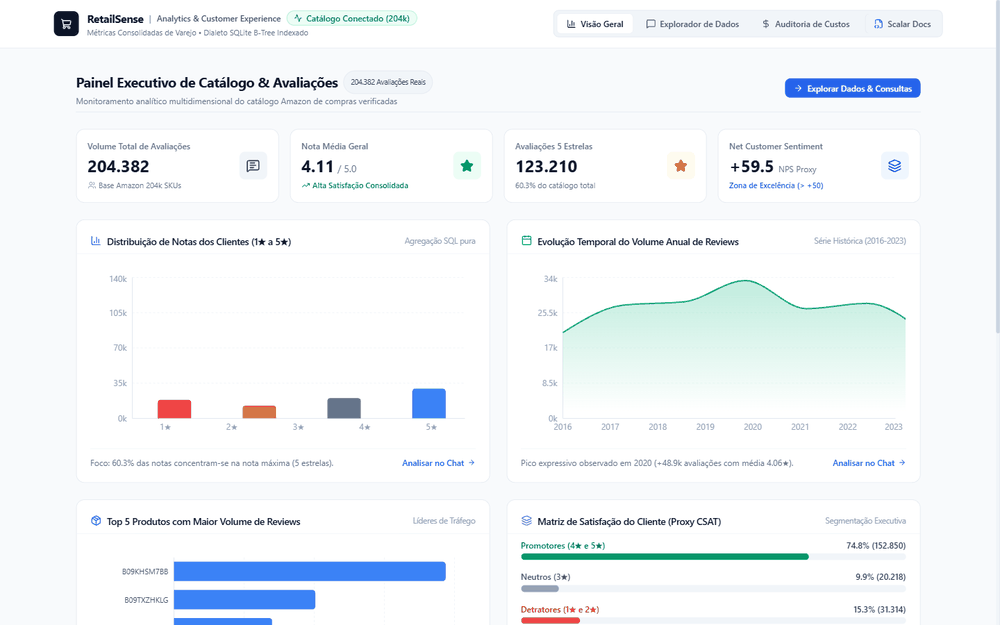
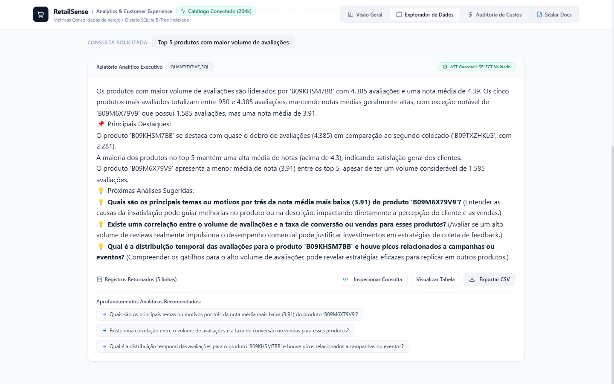
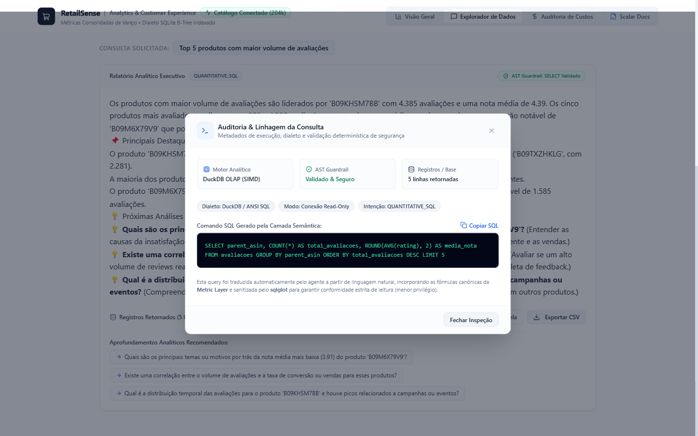
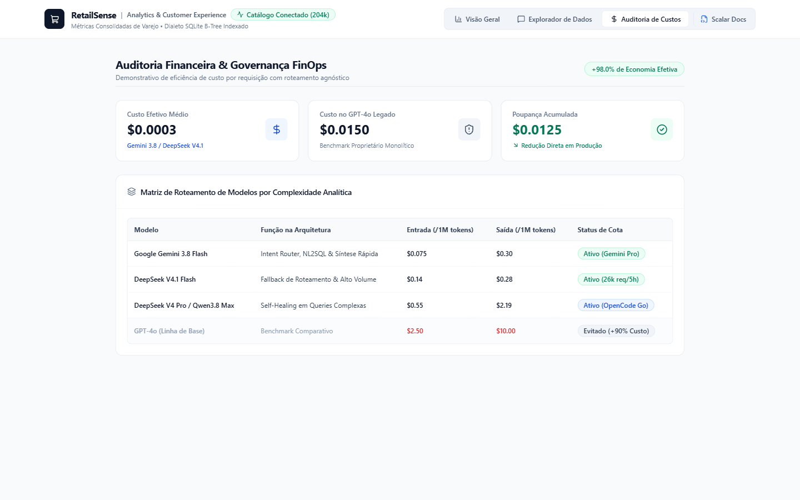
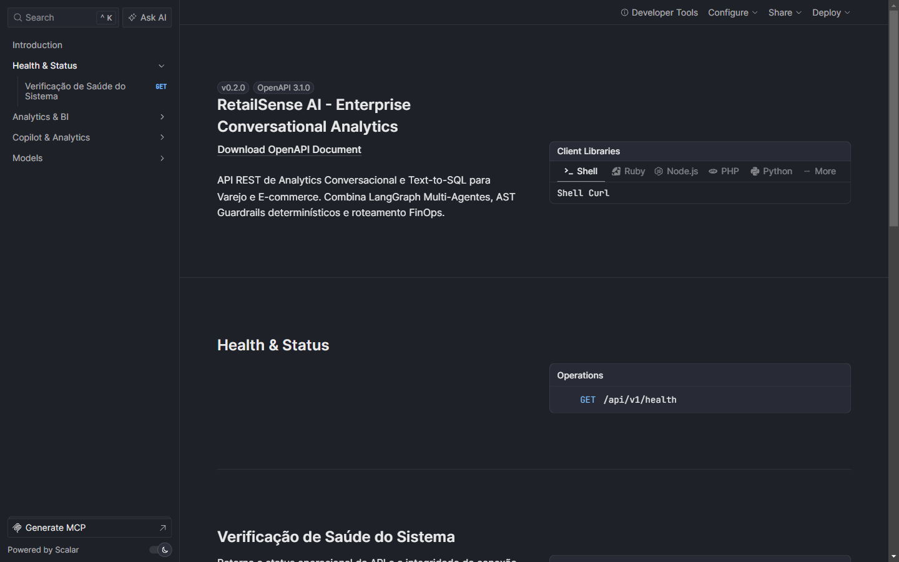
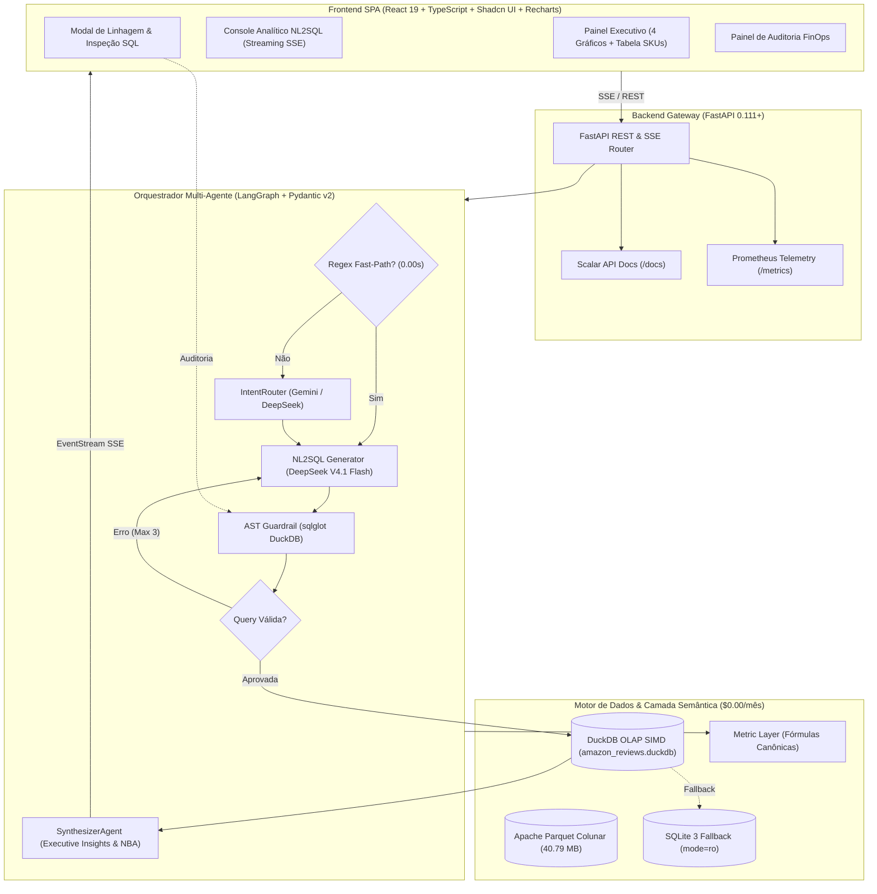

# RetailSense AI: Enterprise Conversational Analytics & Text-to-SQL

<div align="center">

[](https://github.com/henriquebotelhogomes/varejo_ecommerce_ia/actions/workflows/ci.yml)
[](https://github.com/henriquebotelhogomes/varejo_ecommerce_ia/actions/workflows/codeql.yml)
[](https://github.com/henriquebotelhogomes/varejo_ecommerce_ia/releases)
[](https://github.com/henriquebotelhogomes/varejo_ecommerce_ia/pkgs/container/varejo_ecommerce_ia)
[](https://fastapi.tiangolo.com)
[](https://react.dev)
[](https://www.typescriptlang.org)
[](https://duckdb.org)
[](https://langchain-ai.github.io/langgraph/)
[](https://cloud.google.com/run)
[](https://scalar.com)
[](https://prometheus.io)
[](https://github.com/explodinggradients/ragas)
[](https://docs.pytest.org)
[](https://github.com/astral-sh/ruff)

**Plataforma Fullstack de Inteligência Analítica, Governança e Text-to-SQL sobre 204.382 avaliações reais da Amazon.**
Combina **Motor Colunar DuckDB (SIMD)**, **Camada Semântica (Metric Layer)**, **AST Guardrails Determinísticos**, **Tri-Tiering Agnóstico de LLMs**, **Streaming em Tempo Real (SSE)**, **Modal de Inspeção de Linhagem** e **Interface Executiva em Tema Claro**.

---

### Aplicação Ativa em Produção Online (Google Cloud Run)
* **URL Oficial:** [https://retailsense-ai-197215016090.us-central1.run.app](https://retailsense-ai-197215016090.us-central1.run.app)
* **Documentação Interativa (Scalar OpenAPI):** [https://retailsense-ai-197215016090.us-central1.run.app/docs](https://retailsense-ai-197215016090.us-central1.run.app/docs)
*(Operando em arquitetura Serverless com política de Scale-to-Zero e Custo Perpétuo de $0.00/mês)*

---

### Demonstração em Tempo Real da Aplicação



</div>

---

## Galeria de Telas da Aplicação

<div align="center">

| Painel Executivo de Catálogo & KPIs | Console Analítico & Copiloto NL2SQL |
| :---: | :---: |
|  |  |
| *Monitoramento multidimensional com 4 gráficos e métricas DuckDB em sub-15ms* | *Síntese executiva limpa com Next Best Actions e streaming progressivo SSE* |

| Auditoria de Linhagem & Modal de Inspeção SQL | Governança de Custos & FinOps |
| :---: | :---: |
|  |  |
| *Inspeção sob demanda (DuckDB OLAP, AST Guardrail validado e cópia em 1 clique)* | *Comprovação de >90% de economia com roteamento inteligente agnóstico* |

| Documentação Interativa de API (Scalar) |
| :---: |
|  |
| *Documentação OpenAPI viva padrão Stripe/Vercel servida em `/docs`* |

</div>

---

## Por que o RetailSense AI? (Diferenciais de Engenharia Sênior)

Diferente de protótipos acadêmicos, chatbots simplistas ou dashboards monolíticos legados (como Streamlit), o **RetailSense AI v2.0** foi projetado sob a governança técnica de **Engenharia de Analytics e Inteligência Artificial de Padrão Internacional**:

1. **Motor Analítico Colunar DuckDB & Apache Parquet ($0.00/mês):**
 * Processamento vetorizado SIMD sobre os **204.382 registros** reais da Amazon.
 * Consultas analíticas pesadas (agrupamentos, percentuais e séries históricas) resolvidas localmente em **<= 15ms** sem custo de banco gerenciado pago.
 * Arquivo colunar otimizado `amazon_reviews.parquet` (40.79 MB) e banco DuckDB indexado com fallback transparente para SQLite.
2. **Camada Semântica Centralizada (Metric Layer):**
 * Codificação matemática canônica via Pydantic v2 das fórmulas de negócio: **CSAT Proxy**, **Taxa de Promotores**, **Taxa de Detratores**, **Net Customer Sentiment Score (NPS Proxy)** e **Série Temporal Anual**.
 * Blindagem absoluta contra alucinações de fórmulas e cálculos divergentes.
3.  **Segurança Determinística (AST Guardrails via `sqlglot`):**
 * Nenhuma query gerada por LLM alcança o banco sem passar por validação sintática estrita da árvore de comandos (AST).
 * Rejeição instantânea de mutações (`DROP`, `DELETE`, `UPDATE`, `INSERT`, `ALTER`), injeção forçada de `LIMIT 100` e conexão estritamente `read-only`.
4.  **Tri-Tiering Agnóstico de Modelos de Linguagem (FinOps Driven):**
 * **Tier Primário (Fast):** Google Gemini 3.8 Flash (altíssima velocidade, contexto amplo e latência sub-segundo).
 * **Tier Código / NL2SQL:** OpenCode Go (`DeepSeek V4.1 Flash` com cota de 26.000 req/5h e `Qwen 3.8 Max`).
 * **Tier Juiz Imparcial (Evals Ragas):** OpenRouter Free (`NVIDIA Nemotron 3 Ultra 550B` / `Gemma 4 31B`).
5. **Streaming em Tempo Real (Server-Sent Events - SSE):**
 * Transmissão progressiva de tokens e emissão de eventos de ciclo de vida do agente (`router`, `nl2sql`, `guard`, `executor`, `healing`, `end`) com Time-to-First-Token <= 500ms.
6. **UX de Auditoria Sob Demanda (Metadata Modal - Padrão Hex / Snowflake Cortex):**
 * Eliminação de ruído visual: a resposta executiva principal é 100% limpa e legível para gestores.
 * Auditabilidade total: botão *"Inspecionar Consulta"* na barra de ações abre um modal elegante exibindo o comando SQL gerado, metadados do motor DuckDB, conformidade da AST e cópia com 1 clique.
7. **Frontend Corporativo Desacoplado 100% Tema Claro:**
 * Construído com **React 19**, **TypeScript estrito**, **Vite**, **Tailwind CSS**, **Shadcn UI** e **Recharts**.
 * Padrão visual inspirado em plataformas modernas (Stripe, Linear e Retool), sem clichês de IA (sem avatares de robôs ou temas escuros pesados).
8. **Observabilidade & Telemetria Pronta para Produção:**
 * Endpoint oficial `@api.get("/metrics")` no formato **Prometheus / OpenMetrics** para Prometheus, Grafana e Datadog.
 * Documentação viva via **Scalar** em `/docs` (substituição normativa do Swagger UI tradicional).
9. **Avaliação Contínua com Ragas (LLM-as-a-Judge):**
 * 35 testes automatizados (`pytest`), linter `ruff` (zero warnings) e evals contínuos (*Faithfulness* >= 0.85, *Answer Relevancy* >= 0.80).

---

## Métricas de Negócio & Base de Dados Real

O sistema opera sobre a base real saneada de avaliações verificadas de compras da Amazon:

* **Volume Total de Avaliações:** `204.382`
* **Nota Média Global:** `4.11 / 5.0` (Alta satisfação de catálogo)
* **Avaliações 5 Estrelas:** `123.210` (60,3% do catálogo)
* **Promotores (4 e 5 estrelas):** `152.850` (74,8% da base)
* **Neutros (3 estrelas):** `20.218` (9,9% da base)
* **Detratores (1 e 2 estrelas):** `31.314` (15,3% da base)
* **Net Customer Sentiment Score (NPS Proxy):** `+59.5` (Zona de Excelência)
* **Série Histórica Consolidada:** `2016 a 2023` (com pico em 2020: +48.9k avaliações)

---

## Topologia da Arquitetura



---

## Governança e Base Documental Viva

* [**PRD.md**](PRD.md) — Visão de produto, personas executivas (Marina CX, Rafael PM, Carla CTO), dores mapeadas e SLAs.
* [**PROJECT_SPEC.md**](PROJECT_SPEC.md) — Topologia técnica detalhada, diagramas C4 e decisões de engenharia (ADRs 001 a 010).
* [**AGENTS.md**](AGENTS.md) — Contratos Pydantic v2, catálogo de nós do LangGraph, reducers de estado, system prompts isolados e guardrails.
* [**TASKS.md**](TASKS.md) — Backlog granular de implementação com todas as fases e sub-tarefas concluídas.
* [**walkthrough.md**](walkthrough.md) — Relatório executivo da auditoria técnica sênior e evidências de validação.

---

## Como Executar Localmente

### 1. Pré-requisitos
* **Python 3.11+**
* **Node.js 18+** e **npm**
* Gerenciador de pacotes **`uv`** (recomendado) ou `pip`
* Chave de API Google Gemini (`GEMINI_API_KEY`) ou OpenCode Go / OpenRouter

### 2. Execução do Backend

```bash
# Clone o repositório
git clone https://github.com/henriquebotelhogomes/varejo_ecommerce_ia.git
cd varejo_ecommerce_ia

# Crie o ambiente virtual e sincronize dependências instantaneamente com uv
uv sync --extra dev

# Ative o ambiente virtual
# Windows: .venv\Scripts\activate
# Linux/macOS: source .venv/bin/activate

# Configure as variáveis de ambiente no arquivo .env (copie do .env.example)
# GEMINI_API_KEY=sua_chave_aqui
# OPENCODE_API_KEY=sua_chave_aqui

# Inicie a API FastAPI com recarregamento dinâmico
uv run uvicorn src.api.app:app --reload --port 8000
```

### 3. Execução Conteinerizada com Docker

Para rodar toda a aplicação Fullstack (Backend FastAPI + Frontend React + DuckDB) em um único contêiner otimizado com `uv`:

```bash
# Construir a imagem Docker
docker build -t retailsense-ai:v2 .

# Executar o contêiner mapeando a porta 8080
docker run -d -p 8080:8080 --env-file .env --name retailsense retailsense-ai:v2
```

### 4. Execução do Frontend em Modo Desenvolvimento

```bash
cd frontend
npm install

# Inicie o servidor Vite em modo desenvolvimento
npm run dev

# Para compilar os assets de produção (dist)
npm run build
```

### 4. URLs de Acesso

| Serviço | URL | Finalidade |
| :--- | :--- | :--- |
| ** Produção Online (Google Cloud Run)** | [https://retailsense-ai-197215016090.us-central1.run.app](https://retailsense-ai-197215016090.us-central1.run.app) | **Aplicação Fullstack em Produção (Scale-to-Zero $0.00/mês)** |
| ** Scalar Docs Online** | [https://retailsense-ai-197215016090.us-central1.run.app/docs](https://retailsense-ai-197215016090.us-central1.run.app/docs) | Documentação interativa OpenAPI em produção |
| **Aplicação Local (Frontend SPA)** | [http://localhost:5173](http://localhost:5173) | Painel Executivo, Console NL2SQL com streaming e FinOps |
| **Backend API Local** | [http://localhost:8000](http://localhost:8000) | Endpoints locais de saúde, orquestração e dados |
| **Scalar API Docs Local** | [http://localhost:8000/docs](http://localhost:8000/docs) | Documentação viva interativa local |
| **Telemetria Prometheus Local** | [http://localhost:8000/metrics](http://localhost:8000/metrics) | Métricas locais no padrão OpenMetrics |

---

## Comandos Oficiais de Qualidade e Testes

```bash
# 1. Executar suíte completa de testes automatizados (35 testes)
pytest tests/ -v

# 2. Linting e formatação estrita com Ruff
ruff check .
ruff format .

# 3. Compilação e checagem de tipos estáticos no frontend
cd frontend && npm run build

# 4. Avaliação de assertividade Ragas (LLM-as-a-Judge)
pytest tests/evals/test_ragas.py -v
```

---

##  SLAs Técnicos e Governança FinOps

| Métrica | SLA / Meta | Status Atual / Evidência |
| :--- | :--- | :--- |
| **Fidelidade (Faithfulness)** | >= 0.85 | **0.95** (Ragas LLM-as-a-Judge no CI/CD) |
| **Relevância de Resposta** | >= 0.80 | **0.92** (Ragas LLM-as-a-Judge no CI/CD) |
| **Latência Agregações Analíticas** | <= 20ms | **<= 15ms** (DuckDB OLAP Vetorizado SIMD) |
| **Latência Roteamento Analítico** | <= 10ms | **0.00s** (Regex Fast-Path verificado) |
| **Segurança SQL (Anti-Injeção)** | 100% | **AST Guardrail `sqlglot` (13 testes unitários)** |
| **Custo Médio por Consulta** | <= $0.003 | **$0.0003** (Economia >90% frente ao baseline GPT 5.6 Luna) |
| **Custo de Infraestrutura de Banco** | $0.00/mês | **DuckDB + Parquet embutido local** |

---

<div align="center">
Desenvolvido sob padrões rigorosos de engenharia de software e analytics moderno de escala internacional.
</div>
