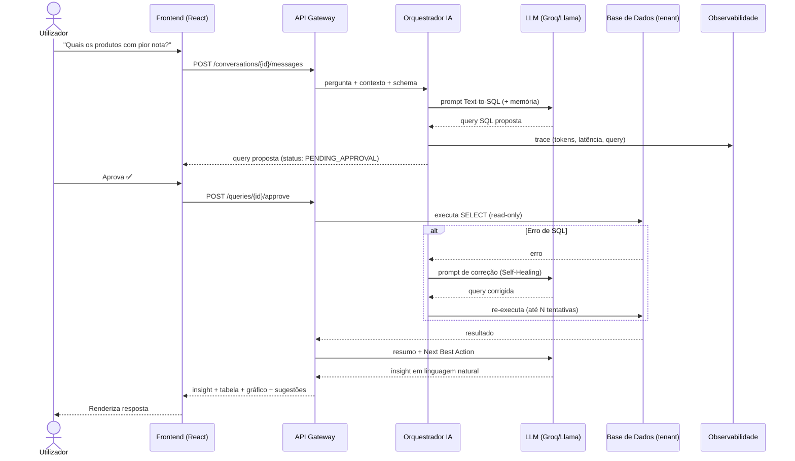

# 02 — Especificação Funcional: RetailSense AI

Este documento descreve **o que** o sistema faz, em termos de funcionalidades, fluxos e regras de negócio. O **como** está na especificação técnica (03) e arquitetura (04).

---

## 1. Mapa de Funcionalidades (Feature Map)

```
RetailSense AI
├── 🔐 Identidade & Acesso
│   ├── Autenticação (email/SSO)
│   ├── Organizações (multi-tenant)
│   └── RBAC (Owner, Admin, Analyst, Viewer)
├── 🔌 Conexão de Dados
│   ├── Datasets de exemplo (Amazon Reviews)
│   ├── Upload (CSV/Parquet)
│   └── Conectores (Postgres, MySQL, BigQuery) [futuro]
├── 💬 Analytics Conversacional (núcleo)
│   ├── Text-to-SQL agêntico
│   ├── Human-in-the-Loop (aprovação de query)
│   ├── Self-Healing de queries
│   ├── Memória conversacional
│   └── Next Best Action (sugestões proativas)
├── 📊 Visualização & Export
│   ├── Tabelas interativas
│   ├── Gráficos automáticos
│   └── Export (CSV / link compartilhável)
├── 🧠 Insights de CX
│   ├── Análise de sentimento de reviews
│   └── Detecção de temas/tópicos
├── 🔍 Observabilidade do Utilizador
│   ├── Logs de raciocínio da IA ("caixa preta")
│   └── Histórico de conversas auditável
└── 💰 FinOps
    ├── Consumo de tokens por interação
    ├── Custo real vs. baseline (ex.: GPT 5.6 Luna)
    └── Limites e alertas de orçamento
```

---

## 2. User Stories (épicos e histórias)

### Épico A — Onboarding & Conexão de Dados
- **A1.** _Como_ novo utilizador, _quero_ explorar com um dataset de exemplo, _para_ ver valor antes de conectar meus dados.
- **A2.** _Como_ Admin, _quero_ carregar um CSV/Parquet, _para_ analisar dados próprios sem engenharia.
- **A3.** _Como_ Admin, _quero_ conectar uma base relacional, _para_ analisar dados em tempo real. _(futuro)_

### Épico B — Analytics Conversacional
- **B1.** _Como_ Analyst, _quero_ perguntar em linguagem natural, _para_ obter respostas sem escrever SQL.
- **B2.** _Como_ Analyst, _quero_ rever e aprovar a query antes da execução, _para_ garantir segurança e correção.
- **B3.** _Como_ Analyst, _quero_ que erros de query sejam corrigidos automaticamente, _para_ não travar na sintaxe.
- **B4.** _Como_ Analyst, _quero_ fazer perguntas de seguimento ("e os piores?"), _para_ aprofundar sem repetir contexto.
- **B5.** _Como_ Analyst, _quero_ sugestões de próximas perguntas, _para_ descobrir insights que eu não pensaria.

### Épico C — Visualização & Compartilhamento
- **C1.** _Como_ utilizador, _quero_ ver os resultados em tabela e gráfico, _para_ interpretar rapidamente.
- **C2.** _Como_ utilizador, _quero_ exportar/compartilhar um insight, _para_ usá-lo numa apresentação.

### Épico D — CX Insights
- **D1.** _Como_ Head de CX, _quero_ ver os principais temas de reclamação, _para_ priorizar correções.
- **D2.** _Como_ Head de CX, _quero_ filtrar reviews por sentimento, _para_ focar nos clientes insatisfeitos.

### Épico E — Governança & FinOps
- **E1.** _Como_ Admin, _quero_ ver o custo de IA por utilizador/equipa, _para_ controlar orçamento.
- **E2.** _Como_ Admin, _quero_ definir limites de uso, _para_ evitar surpresas na fatura.
- **E3.** _Como_ Auditor, _quero_ consultar o histórico completo de queries executadas, _para_ compliance.

---

## 3. Fluxo Principal — Pergunta → Insight (com governança)



---

## 4. Regras de Negócio

| ID | Regra | Justificativa |
|----|-------|---------------|
| RN-01 | A IA **nunca** executa SQL diretamente; só após aprovação (humana ou política). | Segurança / Trust by design. |
| RN-02 | Apenas operações **read-only** (`SELECT`) são permitidas. `INSERT/UPDATE/DELETE/DROP` são bloqueados. | Integridade dos dados. |
| RN-03 | Self-Healing limitado a **N tentativas** (padrão 3) com backoff. | Controlo de custo e loops. |
| RN-04 | Memória conversacional usa **janela truncada** (últimas K interações). | Custo de tokens e foco contextual. |
| RN-05 | Toda interação com LLM **regista tokens e custo** estimado. | FinOps / auditoria. |
| RN-06 | Resultados são **isolados por tenant** (org). Nenhum dado cruza fronteiras. | Multi-tenancy / segurança. |
| RN-07 | Queries e respostas são **persistidas para auditoria** com retenção configurável. | Compliance. |
| RN-08 | Limite de linhas/colunas retornadas ao LLM para sumarização. | Custo e prevenção de overflow de contexto. |

---

## 5. Estados de uma Query (máquina de estados)

```
DRAFTED ──► PENDING_APPROVAL ──► APPROVED ──► EXECUTING ──► SUCCEEDED
                  │                                │
                  ├──► REJECTED                    ├──► HEALING ──► EXECUTING
                                                   └──► FAILED (após N tentativas)
```

---

## 6. Requisitos de Acessibilidade & i18n

- Interface **WCAG 2.1 AA** (contraste, navegação por teclado, ARIA).
- **i18n** desde o início (pt-BR, pt-PT, en). Conteúdo gerado pela IA respeita o locale do utilizador.
- Suporte a **dark/light mode**.

---

## 7. Fora de Escopo (nesta fase)

- Edição/escrita de dados pela IA (apenas leitura).
- Treino/fine-tuning de modelos próprios.
- Conectores em tempo real para todos os data warehouses (faseado — ver roadmap).
- App mobile nativo (web responsivo primeiro).
