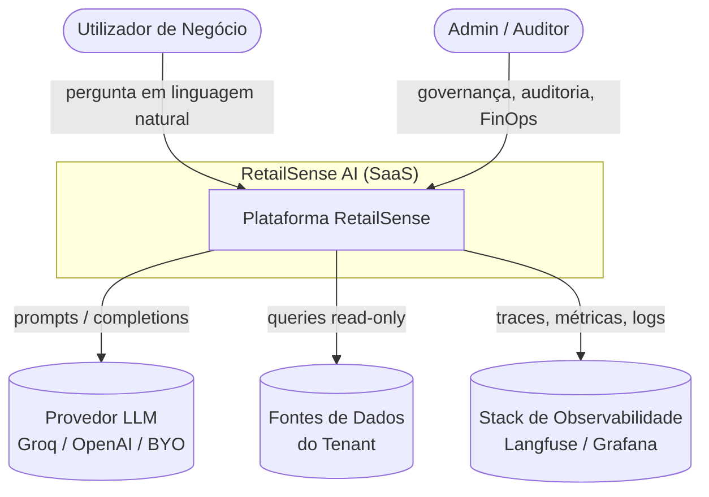
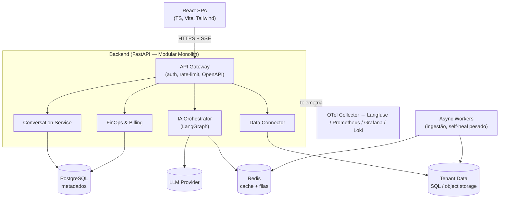

# 04 — Proposta de Arquitetura

## 1. Princípios Arquiteturais

1. **Modularidade por domínio** — serviços com fronteiras claras (auth, conversa, IA, dados, finops).
2. **API-first** — todo recurso exposto por contrato versionado (OpenAPI). Frontend é só mais um cliente.
3. **Stateless onde possível** — estado em Postgres/Redis, não nos processos → escala horizontal.
4. **Trust by design** — segurança, auditoria e HITL são camadas transversais, não opcionais.
5. **Observabilidade nativa** — instrumentação desde o primeiro endpoint.
6. **Cost-aware** — IA tratada como recurso pago e medido em todas as fronteiras.
7. **Evolução incremental** — começar como modular monolith, extrair serviços só quando justificado.

---

## 2. Estilo Arquitetural

**Modular Monolith → Serviços seletivos.**

Começar com um **monólito modular** (FastAPI) bem organizado por bounded contexts, com a opção de extrair serviços (ex.: IA Orchestrator, Ingestão) quando escala/equipa justificarem. Isto evita a complexidade prematura de microserviços e é uma decisão **madura e defensável** (ver ADR-001 no doc 11).

---

## 3. Diagrama de Contexto (C4 — Nível 1)



---

## 4. Diagrama de Contêineres (C4 — Nível 2)



---

## 5. Componentes Principais (explicação de alto nível)

### 5.1 API Gateway (FastAPI)
Porta de entrada única. Responsável por autenticação (JWT/OAuth), rate-limiting por tenant, validação (Pydantic), versionamento e geração automática do contrato OpenAPI. Suporta **SSE** para streaming de respostas da IA.

### 5.2 Conversation Service
Gere sessões e histórico, aplica a **janela de memória truncada**, persiste mensagens/queries de forma auditável e coordena a máquina de estados das queries (ver doc 02 §5).

### 5.3 IA Orchestrator (LangGraph)
O cérebro. Implementa o grafo de estados da pipeline (geração → guard → HITL → execução → self-heal → sumarização → NBA). Cada nó é instrumentado e testável. Abstrai o provedor de LLM atrás de uma interface (`LLMProvider`), habilitando **BYO-LLM** e fallback entre modelos.

### 5.4 Data Connector
Abstrai fontes heterogéneas (dataset de exemplo, upload CSV/Parquet, conectores SQL). Faz **introspecção de schema** (cache), aplica **execução read-only com timeout e LIMIT**, e isola conexões por tenant.

### 5.5 FinOps & Billing
Contabiliza tokens/custo por chamada, agrega por utilizador/equipa/tenant, aplica **limites e alertas de orçamento** e alimenta os planos de cobrança. Compara custo real vs. baseline (ex.: GPT-4o) — feature de transparência herdada do MVP atual.

### 5.6 Async Workers
Processam tarefas pesadas fora do request-path: ingestão de grandes datasets, reindexação semântica de reviews, jobs de evals agendados.

### 5.7 Camada de Observabilidade
Coletor OpenTelemetry → **Langfuse** (traces de LLM, custo, qualidade) + **Prometheus/Grafana** (métricas de sistema) + **Loki** (logs estruturados). Ver doc 06.

---

## 6. Multi-Tenancy

**Estratégia:** _shared database, isolated rows_ para metadados (coluna `org_id` + Row-Level Security no Postgres), e **isolamento físico/lógico para dados do tenant** (schema/DB/conector por organização).

| Aspeto | Decisão |
|--------|---------|
| Metadados | Postgres com **RLS** por `org_id`. |
| Dados do tenant | Conexão/credencial isolada por org; nunca compartilhada. |
| Segredos | Vault/Secret Manager por tenant. |
| Escalada Enterprise | Opção de **isolamento dedicado (VPC/DB próprio)**. |

---

## 7. Fluxo de Dados (resumo)

1. **Ingestão** (assíncrona): fonte → introspecção de schema → cache de metadados.
2. **Pergunta** (síncrona, streaming): NL → SQL → guard → HITL → execução → insight.
3. **Auditoria & FinOps** (transversal): todo passo emite eventos persistidos e métricas.

---

## 8. Decisões-chave (resumo — detalhe no doc 11)

| Decisão | Escolha | Alternativa rejeitada |
|---------|---------|----------------------|
| Estilo | Modular monolith | Microserviços desde o início (complexidade prematura) |
| Backend | FastAPI | Flask/Django (async + tipagem + OpenAPI) |
| Frontend | React SPA | Manter Streamlit (limite de UX/branding) |
| Guard de SQL | Parser estático + allow-list | Confiar só no prompt (inseguro) |
| LLM | Abstração multi-provider, Groq default | Lock-in num provedor |
| Observabilidade IA | Langfuse + OTel | Logs caseiros (não escala) |

---

## 9. Topologia de Deploy (alvo)

```
Internet ─► CDN/WAF ─► Load Balancer ─► [React SPA estático]
                                   └──► [FastAPI pods (HPA)] ─► Postgres (managed, réplicas)
                                                              ├─► Redis (managed)
                                                              └─► Workers (queue-driven autoscale)
```

- **Containerizado** (Docker), orquestrado em **Kubernetes** ou **Cloud Run**.
- **IaC** com Terraform; ambientes `dev`/`staging`/`prod` idênticos.
- **Deploys canário** com feature flags e rollback automático por SLO.
